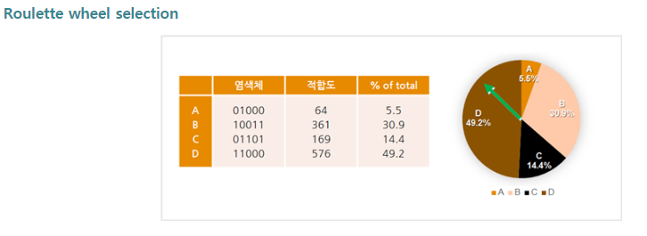

# Genetic-algorithm

서로 다른 두 변수에 대한 선형 관계를 나타내기 위해 정보를 **일일 근로시간에 대한 월급의 양**으로 지정했습니다.

일일 근로시간은 월 근로시간을 근로일수로 나누어 일일 근로시간을 구했으며 

| 년도               | 2014 | 2015 | 2016 | 2017 | 2018 | 2019 |
| ------------------ | ---- | ---- | ---- | ---- | ---- | ---- |
| **노동시간**(시간) | 8.28 | 8.29 | 8.30 | 8.27 | 8.20 | 8.16 |
| **월 임금**(백만)  | 2.90 | 2.99 | 3.11 | 3.21 | 3.38 | 3.49 |

이러한 데이터 표를 얻을 수 있습니다.

## 초기염색체 생성

초기 염색체, 즉 1세대를 구성하기 위해서 무작위로 년도를 뽑아서 염색체를 생성합니다.

그 뒤에, 노동시간과 월 임금을 독립변수로 둡니다. 즉 ,노동시간을 x축, 월 임금을 y축으로 두고 수많은 자손 염색체들을 통해 회귀되는 식이 선형모델이라고 할때, 무작위로 뽑힌 년도(점)들로 직선이 만들어 지게 됩니다.

이렇게 만들어지는 직선들이 1세대 염색체들이며 각 염색체에는 유전자 정보가 들어가 있게 되는것입니다.  

이때 유전자 정보 표기를 몇개의 비트로 하느냐에 따라 다르게 표기되는데, 시간은 정수부분이 일정함으로 소수점부분만 8비트로 표현하고, 임금은 정수부분이 2이면 0, 3이면 1을 할당하고 나머지 소수부분에 7비트를 줘서 표현합니다.**ex)** 2014년도 좌표 표기: x(8.28)=0001 1100, y(2.90): 0101 1010

## 적합도 판단

적합도 계산은, 변수들 사이의 관계를 가장 잘 나타내기 위해 실행합니다. 이는 곧 두 변수, 즉 두 x,y좌표로 표기된 점들에 가장 가까운 거리에 있는 직선을 구하는 것이 됩니다. 예를들어,

 

위에 그림을 보면 직선들이 염색체라고 볼 수 있습니다. 동일한 점에 대해 (a)그림의 직선이 (b)그림의 직선보다 훨씬 더 가까운 거리를 가지고 있는것을 볼 수 있습니다. 이를 통해 (a)그림 염색체 적합도가 더 높다고 볼 수 있는것입니다.

따라서 무작위로 선택된 집단에서 2개의 점을 뽑아 직선을 만들고 나머지 집단안에 있는 점들과의 거리를 모두 구해 더한 값이 작을수록 더 높은 적합도를 가지고 있는것이기 때문에 선택연산에서 이 값을 가지고 판단합니다.

이때 이 값을 SumError라고 하겠습니다.

## 선택 연산

적합도 판단을 거친 뒤, 자손을 형성할 염색체를 선택해야 하는데 이때 여러 선택방법이 있습니다.

룰렛 선택은 각 염색체의 적합도에 비례하는 만큼 룰렛의 영역을 정해준 다음, 룰렛을 돌려 화살표가 가리키는 염색체를 선택하는 방법입니다. 다만 이 방법은 적합도가 높은 염색체만 선택될 확률이 많다는 단점이 있습니다.

룰렛 선택을 보완하기 위해 나온 순위 기반 선택은 적합도의 크기 순서에 따라 순위를 매기고 그에 따라 확률을 결정해서 선택하는 방법입니다.

그래서 위에 나온 SumError 값을 적은 순으로 랭크를 매긴 다음 높은 랭킹 순으로 확률을 할당해줍니다.

## 교차연산

각 염색체에는 2개의 년도에 대한 임금과 노동시간 정보가 들어가 있습니다.

이 정보를 가지고 자손 염색체를 생성하기 위해 교차 연산을 해야 하는데 여러 교차하는 방법이 있는데,

단순교차는 하나의 교차위치를 설정하며, 그 전후를 기준으로 교환합니다.

복수점 교차는 교차위치가 복수인 경우이며, 기준을 전후로 떼어네어 형질을 교환합니다. 

그렇다면, 염색체 1에 년도 a ,b ,염색체 2 에 년도 c,d에대한 정보가 들어있다고 할때, a와c, b와d의 x좌표,y좌표에서 가운데 부분에서 교차연산을 해서 자식 염색체를 생성합니다.

## 돌연변이 연산

돌연변이 확률이 높아지면 회귀식의 수렴성이 떨어져 프로그램 구현 시간이 길어지므로 일반적으로 많이 설정하는 0.1%라고 하겠습니다. 그리고 돌연변이가 발생되었을 때, 맨 앞에서 4번째 비트가 변화되도록 하겠습니다.

## 연산 종료 후

전 세대에서 모든 연산을 끝낸 뒤, 다음 세대로 넘어 갈 때, 전 세대에서 높은 적합성을 보였던 2개의 염색체는 그대로 이전 하고, 연산과정을 통해 도출된 4개의 염색체를 추가하여 새로운 세대를 만들겠습니다.

## Simulation

첫번째 세대에서 2014,2016,2018,2019 가 선택되었다고 하겠습니다.

그러면 총 6개의 염색체가 만들어 지는데,

G1 14-16: 0001 1100 0101 1010 0001 1110 1000 1011

G2 14-18: 0001 1100 0101 1010 0001 0100 1010 0110

G3 14-19: 0001 1100 0101 1010 0001 0000 1011 0001

G4 16-18: 0001 1110 1000 1011 0001 0100 1010 0110

G5 16-19: 0001 1110 1000 1011 0001 0000 1011 0001

G6 18-19: 0001 0100 1010 0110 0001 0000 1011 0001

이 다음, 염색체의 적합도를 판단해야 합니다.

두 점 사이를 지나는 직선을 그린 다음 남은 두점과의 거리의 합을 구하고 선택연산을 통해 이 값이 가장 작은 순서대로 염색체 마다 순위를 매깁니다.  이 과정을 거친 후 나온 염색체를 G2와 G5라고 하면,

G2와 G5의 교차연산을 통해 자식 염색체가 나오게 됩니다.

G2  : 0001 1100 0101 1010 0001 0100 1010 0110

G5  : 0001 1110 1000 1011 0001 0000 1011 0001

SG1 : 0001 1110 0101 1011 0001 0000 1010 0001			 

SG2 : 0001 1100 1000 1010 0001 0100 1011 0110

다시 또 선택 연산을 해서 뽑힌 염색체를 G3 와 G4라 하겠습니다.

G3   : 0001 1100 0101 1010 0001 0000 1011 0001

G4   : 0001 1110 1000 1011 0001 0100 1010 0110

SG3 : 0001 1110 0101 1011 0001 0100 1011 0110

SG4 : 0001 1100 1000 1010 0001 0000 1010 0001

이렇게 나온 자손 염색체 중 SG4에서 돌연변이를 일으켰다면,

SG4 : 0000 1100 1000 1010 0001 0000 1010 0001

이 될것입니다.

모든 연산이 끝나면 새로 생성된 4개의 자손 염색체와 기존에 가장 적합도가 높았던 두 염색체를 더해 새로운 세대의 염색체 집단이 만들어 지게 됩니다.

새로운 세대의 염색체 집단을 가지고 다시 또 적합도 판단을 하고 선택 연산을 해주는 등 일련의 과정들을 반복적으로 거치다가 목표로 하는 적합도를 가진 염색체가 나오면 프로그램을 종료하고, 목표 적합도에 맞는 염색체에 들어있는 2개의 좌표정보를 가지고 그래프를 출력해 내면 됩니다. 